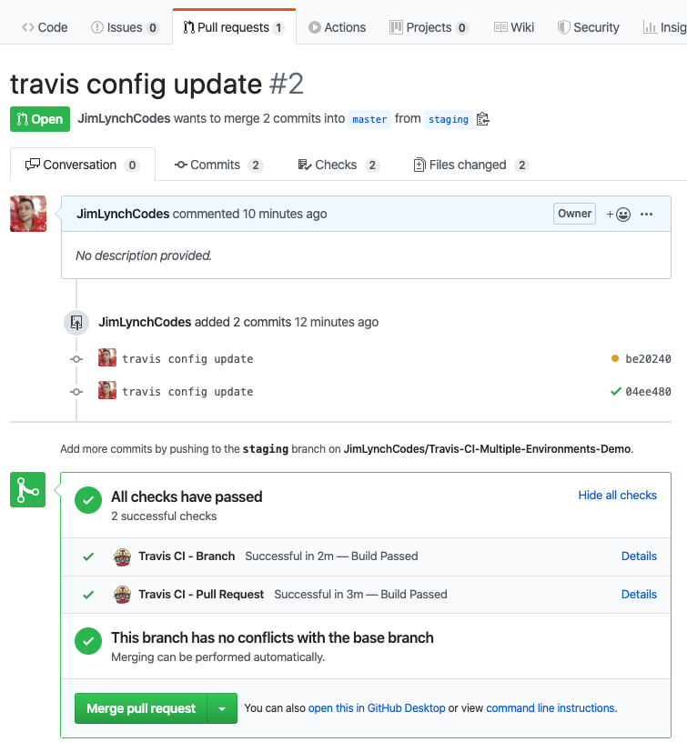

# Travis CI Multiple Environments Demo

This project is an example of how you might setup configure your continuous integration and continuous deployment for three environments with TravisCI for some arbitrary git project.

# Dev, Staging, & Production

The names are arbitrary as long as everyone understands the order. In this example the flow will be:

-> dev -> staging -> production

# Branch-Based Environments

With branch-based environments we have a branch for each environment, and to keep things simple I like to give each of the git branches the same names as the environments above.

- When code is merged into (or pushed to) either the `dev`, `staging`, or `production` branch a CI build is automatically kicked off, and upon successful completion the finished build is deployed to the respective branch.

- When a pull request is opened, two builds are automatically kicked off:
   - 1. A build of the current branch asking to be merged.
   - 2. A build of the "post-merge" version of the branch getting code merged into it. 

    

   ^ Having these 2 automatic builds and test runs is a great time saver for any code review process! 

# Platform / Language Agnostic
This project demonstrates how to use TravisCi for a NodeJS project, but Travis supports loads of other languages so this 3-environment CI/CD pattern can be applied to all sorts of projects! Even if you decide to go with another CI platform other than Travis, you can take the mentality and ability to leverage the results of the tests and builds at various points throughout the deployment process and rollout of features across envvironments in an organized and efficient fashion. 

# Contributing
I'd love to hear your thoughts and suggestions on this project! Feel free to open issues or PR's, and I'll respond as soon as I can. Thanks! ❤️ 
